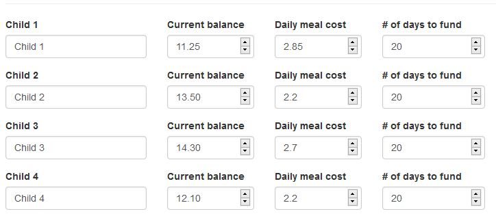
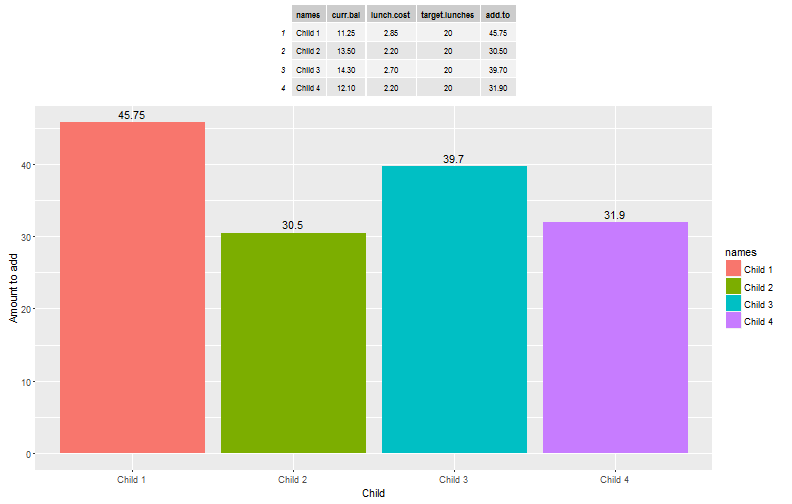

MySchoolBucks funds calculator
========================================================
font-family: 'Helvetica'
author: Thomas Hunt
date: 2016/02/27

Benifits of app
========================================================
- Reduces the amount of time it takes to calculate how much you need to add for multiple accounts
- Reduces simple mathematical errors
- It's easy to use
- [Link to MySchoolBucks calculator](https://x679845678.shinyapps.io/MySchoolBucks_calculator/)

Using the app:
========================================================

It's simple, just enter the following:

- Child's name (Optional)
- Current balance (defaults to 0)
- Daily meal cost (can be a combination of breakfast and lunch)
- Number of days to fund meals for

Example entry
========================================================
 - Input values and get results!

Output Results
========================================================
The output values allow you to align the balance of the accounts so they are equally funded.

